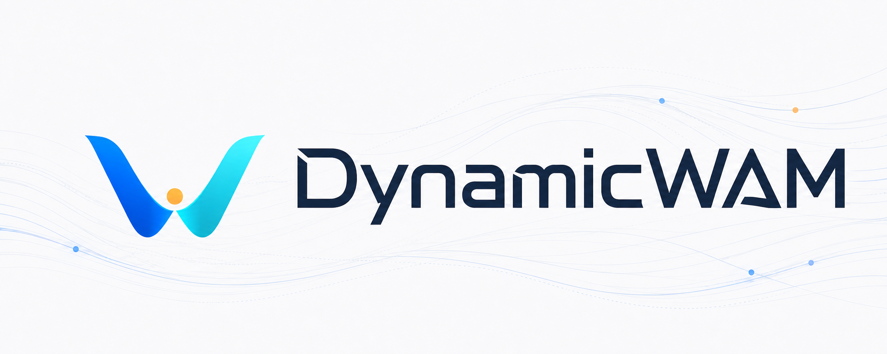

<div align="center">



**Dual-path motion conditioning for World–Action Models in dynamic manipulation**

<a href="https://dynamicwam.github.io/"></a>
<a href="https://huggingface.co/KhalilGao/DynamicWAM/tree/925cbb7aef5033c924f809ae87479d39fe9f76ff"></a>
<a href="LICENSE"></a>


</div>

---

DynamicWAM is a compact World–Action Model for dynamic object manipulation with
**dual-path motion conditioning**:

1. **History-flow conditioning** — temporally aligned optical-flow frames are
   encoded with the current observation through a frozen pretrained video VAE,
   preserving spatial motion structure for future prediction.
2. **Kinematic token conditioning** — descriptors of displacement, interval
   duration, velocity, and acceleration are injected into the action expert,
   supplying motion magnitude and timing that per-frame flow rendering discards.

The two paths are fused through layer-wise joint world–action attention. A
distilled compact video expert and Real-Time Chunking (RTC) enable responsive
real-robot control.

On DOMINO Level 1, DynamicWAM reaches **38.2% success** and a **53.2**
manipulation score. Across 12 real-world tasks (linear, circular, and compound
target motion), it achieves a **46.7%** average success rate.

## Demo

<div align="center">
  
</div>

Real-robot rollouts — a cube tracked along a compound path, then a turntable
appearance never seen during training. Full video on the
[project page](https://dynamicwam.github.io/).

## Quick Start

The shortest supported path verifies the released checkpoint and prepares the
WAN assets required for model inference. It requires Linux x86_64, an NVIDIA
GPU with a working CUDA toolchain, Python 3.10–3.12, and
[`uv`](https://docs.astral.sh/uv/).

```bash
git clone https://github.com/Autumn1337/DynamicWAM.git
cd DynamicWAM

uv sync --extra dev
uv pip install flash-attn==2.8.3.post1 --no-build-isolation

uv run hf download KhalilGao/DynamicWAM \
  --revision "925cbb7aef5033c924f809ae87479d39fe9f76ff" \
  --include "external/checkpoints/DynamicWAM_full.pt" \
  --include "configs/absolute_motion_v2.yaml" \
  --local-dir .

uv run python scripts/verify_checkpoints.py
uv run python scripts/prepare_external.py wan --purpose inference
uv run python scripts/verify_external.py wan-inference
```

A successful setup ends with `verified full checkpoint and config` and
`verified external scope: wan-inference`. The checkpoint and model assets are
then ready; continue with [Evaluation](#evaluation) to install DOMINO, RoboTwin,
and CuRobo and run the supported end-to-end rollout entry point.

## Method overview

| Path | What it provides | Where it enters |
|---|---|---|
| History flow (\(K{=}4\) rendered RGB maps) | Spatial structure, direction, temporal ordering | Frozen video VAE → video expert |
| Kinematic tokens (12-D descriptors × 4 intervals) | Displacement scale, duration, velocity, acceleration | Action expert |
| Joint world–action attention | Coupled future-video prediction and action generation | Every transformer block |

Training proceeds in three stages: video-expert distillation, action-expert
pretraining, and joint refinement. DOMINO evaluation uses the benchmark's
native synchronous protocol; real-robot deployment uses RTC for asynchronous
chunk execution.

## Results — DOMINO Level 1

All 35 clean Level-1 tasks, 100 episodes per task, unseen instructions, native
synchronous protocol with 16 committed joint-position actions per observation:

| Method | Latency (ms) ↓ | SR (%) ↑ | MS ↑ |
|---|---:|---:|---:|
| OpenVLA | 173.6 | 1.5 | 6.1 |
| \(\pi_0\)-FAST | 119.9 | 3.5 | 20.9 |
| \(\pi_{0.5}\) | 59.1 | 9.6 | 26.2 |
| PUMA | 85.4 | 17.2 | 35.0 |
| InternVLA-A1.5 | 552.2 | 29.3 | 42.5 |
| **DynamicWAM (ours)** | 173.7 | **38.2** | **53.2** |

### Ablation of dual-path motion conditioning

| Variant | SR (%) ↑ | MS ↑ |
|---|---:|---:|
| DynamicWAM (w/o flow & motion) | 22.7 | 38.3 |
| DynamicWAM (w/o motion) — history flow only | 27.2 | 41.6 |
| DynamicWAM (w/o flow) — kinematic tokens only | 30.5 | 47.2 |
| **DynamicWAM (ours)** | **38.2** | **53.2** |

## Results — Real world

12 tasks × 20 trials, spanning linear (L1), circular (L2), and compound (L3)
target motion. DynamicWAM uses RTC; external baselines use their official
synchronous protocols:

| Method | L1 | L2 | L3 | Avg. |
|---|---:|---:|---:|---:|
| InternVLA-A1.5 | 0.00 | 0.00 | 0.00 | 0.00 |
| \(\pi_{0.5}\) | 32.50 | 38.75 | 0.00 | 23.75 |
| DynamicVLA | 30.00 | 33.75 | 0.00 | 21.25 |
| DynamicWAM (w/o flow & motion) | 37.50 | 35.00 | 2.50 | 25.00 |
| DynamicWAM (w/o motion) | 51.25 | 42.50 | 15.00 | 36.25 |
| DynamicWAM (w/o flow) | 55.00 | 47.50 | 17.50 | 40.00 |
| **DynamicWAM (ours)** | **70.00** | **51.25** | **18.75** | **46.67** |

RTC improves average success from 42.08% (synchronous) to 46.67% (+4.59 points).

## Installation

Linux x86_64 with an NVIDIA GPU, Python 3.10–3.12. The dependency graph is
locked in `uv.lock`; FlashAttention installs separately because its wheel must
match the local CUDA and GPU architecture:

```bash
git clone https://github.com/Autumn1337/DynamicWAM.git
cd DynamicWAM
uv sync --extra dev
uv pip install flash-attn==2.8.3.post1 --no-build-isolation
```

## Checkpoint and external assets

Weights, simulator assets, and datasets stay outside Git; every revision and
SHA-256 is pinned in `manifests/`.

```bash
hf download KhalilGao/DynamicWAM \
  --revision "925cbb7aef5033c924f809ae87479d39fe9f76ff" \
  --include "external/checkpoints/DynamicWAM_full.pt" \
  --include "configs/absolute_motion_v2.yaml" \
  --local-dir .
uv run python scripts/verify_checkpoints.py

uv run python scripts/prepare_external.py wan --purpose inference
uv run python scripts/bootstrap_domino.py
uv run python scripts/prepare_external.py robotwin-assets
uv run python scripts/prepare_external.py curobo-source
```

## Evaluation

DOMINO evaluation runs in a separate Python 3.10 environment because the
simulator and CuRobo require a different PyTorch/CUDA stack:

```bash
python3.10 -m venv external/robotwin
external/robotwin/bin/pip install -r environments/evaluation.txt
external/robotwin/bin/pip install -e . --no-deps

TORCH_CUDA_ARCH_LIST=9.0 \
  external/robotwin/bin/pip install -e external/curobo \
  --no-build-isolation --no-deps

external/robotwin/bin/python scripts/prepare_external.py domino-runtime
external/robotwin/bin/python scripts/eval_domino.py
```

## Training

The canonical profile is `configs/absolute_motion_v2.yaml`. Training prompts
are generated from the pinned DOMINO instruction generator (`seen` pool);
evaluation generates `unseen` instructions at runtime. Fresh training also
needs the History-Flow WAM initialization named under `paths.base_checkpoint`,
which is not part of the minimal release.

```bash
uv run python scripts/prepare_external.py wan \
  --purpose language --purpose packing --purpose training

uv run python scripts/collect_domino.py
uv run python scripts/precompute_language.py
uv run python scripts/convert_domino.py
uv run python scripts/precompute_motion.py
uv run python scripts/pack_dataset.py
scripts/train_all.sh
```

`scripts/train.py` exposes the three stages individually: video-expert
distillation, action-expert pretraining, and joint refinement.

## Acknowledgements

DynamicWAM builds on four upstream projects, pinned by revision in
`manifests/external_assets.json`:

| Project | Used for |
|---|---|
| [DOMINO](https://github.com/H-EmbodVis/DOMINO) | Dynamic manipulation benchmark, tasks, and instruction generator |
| [Wan2.2-TI2V-5B](https://huggingface.co/Wan-AI/Wan2.2-TI2V-5B) | Video-expert initialization and language preprocessing |
| [RoboTwin 2.0](https://huggingface.co/datasets/TianxingChen/RoboTwin2.0) | Simulator assets |
| [CuRobo](https://github.com/NVlabs/curobo) | Motion planning during evaluation |

## Citation

If you find this work useful, please cite:

```bibtex
@inproceedings{dynamicwam2027,
  title     = {DynamicWAM: Dual-Path Motion Conditioning for World--Action Models in Dynamic Manipulation},
  author    = {},
  booktitle = {Proceedings of the AAAI Conference on Artificial Intelligence},
  year      = {2027}
}
```

## License

Project-owned code is released under the [Apache License 2.0](LICENSE).
Vendored WAN-derived files and the DOMINO patch retain their upstream
licenses. CuRobo is an external dependency under NVIDIA's non-commercial
research/evaluation terms; the project license does not override that
restriction.
